# Informe de Análisis de Datos:
**Script utilizado: PF_Trips_Region.R**

En esta sección se muestran los resultados más notables de los análisis de datos realizados a los datasets originales de yellow taxis de NYC obteniendo observaciones y conclusiones relevantes que serán luego utilizadas en las demás secciones de análisis y de ejecución del proyecto.

## Análsis de métricas generales de la ciudad

  
<b>Estadísticas generales</b>

Al hacer el análisis exploratorio de datos se encontró una marcada periodicidad semanal lo cual se ejemplifica en la siguiente gráfica (Noviembre 2023) notar que el minimo mensual, el jueves 23/11 es el dia de accion de gracias probablemente el feriado más importante (en este mes rompe la tendencia de que los días jueves son los días con mayor cantidad de viajes)

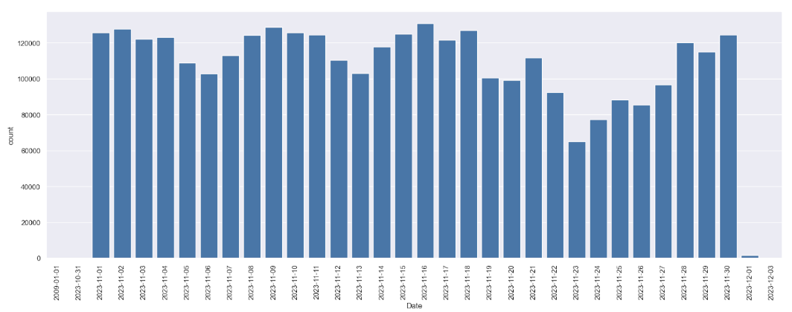

Por otro lado no se encontró una correlación con el clima predominante en cada día.

Se comprobó que fare_amount, trip_distance y trip_duration sean distribuciones bivariadas y se analizaron correlaciones. Interesantemente fare_amount y trip_distance tienen un coeficiente de correlación del 3% en el dataset original (no incluyendo negativos) pero, si se eliminan outliers de una forma eficiente, el coeficiente de correlación entre ambos pasa a 90%. Fare_per_mile y fare_per_minute no parecen estar correlacionados (coef de correlacion -7%) después de sacar outliers.

  
<b>Estadística de viajes por Borough</b>

### Estadística de viajes por Borough
Analizando cual es la distribución de viajes de taxis en los distintos meses, segun Borough de origen y Borough de llegada. Un par de ejemplos (de la serie mensual) son los siguientes gráficos (notar la escala logarítmica de los colores). Consistentemente se observa que los viajes Manhattan-Manhattan son los predominantes en cantidad y en un análisis un poco más amplio geográficamente la gran mayoría de los viajes están concentrados en el binomio Manhattan-Queens

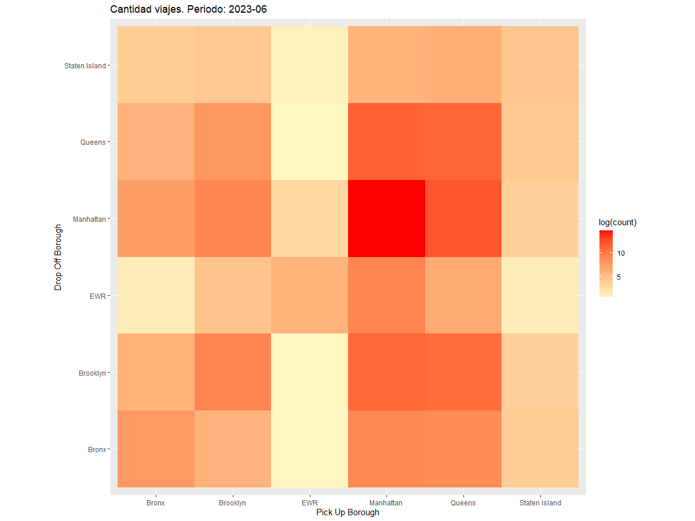
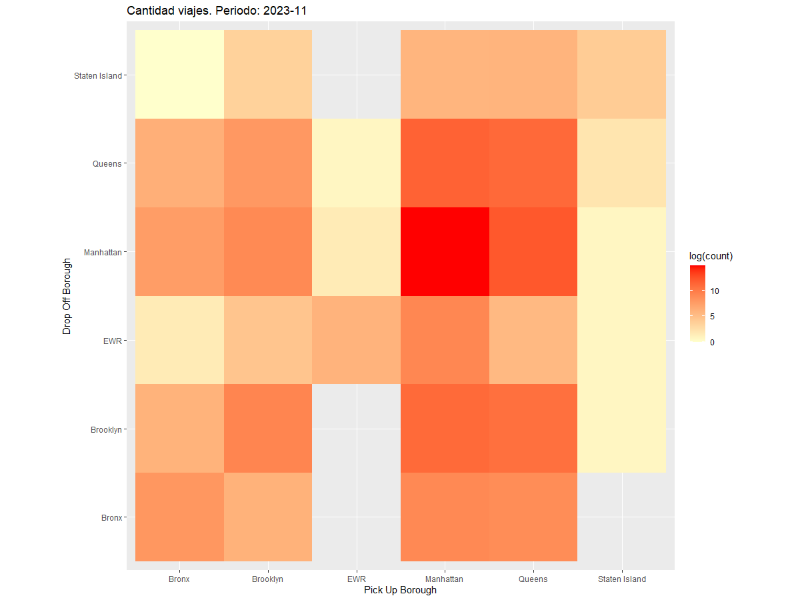

Si ahora se realiza el mismo análisis pero con las medidas fare_per_mile y fare_per_minute (tarifa cobrada por milla recorrida o minuto de viaje, respectivamente) se observa que los viajes internos en Staten Island son los más eficientes en términos de tiempo y los internos a Bronx en término de distancia recorrida, pero cabe recordar (por lo anterior) que estos distritos no poseen una demanda importante. Inclusive, en estas gráficas se excluyó a EWR porque si bien performa órdenes de magnitud mejor en estas dos medidas la cantidad de viajes en ese Borough es marginal.

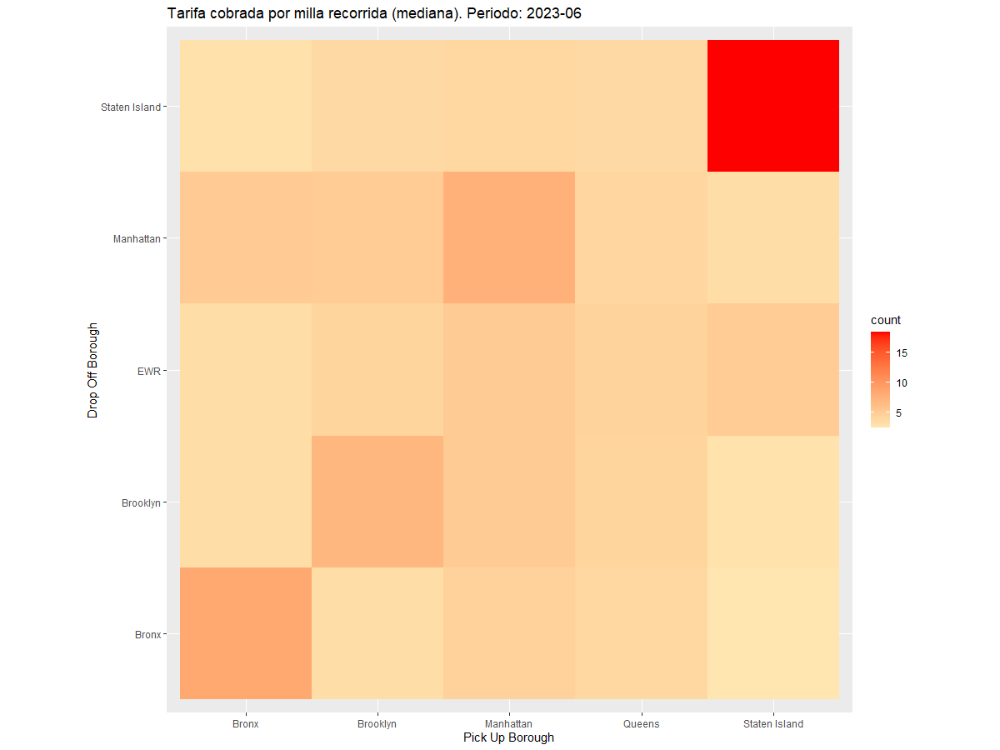
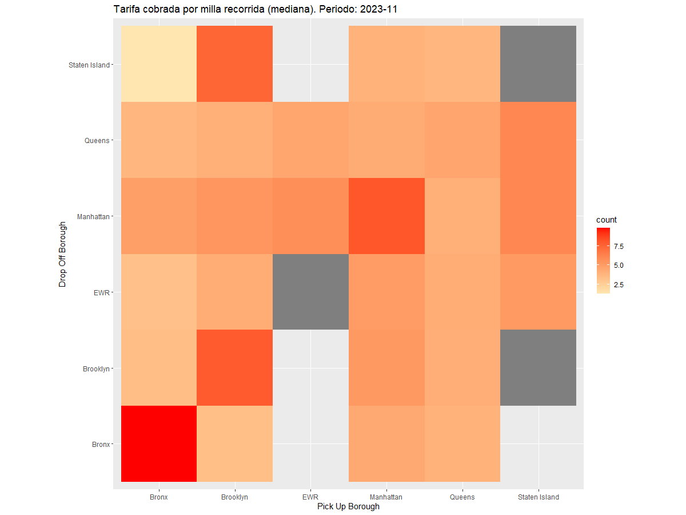

  
<b>Análisis temporal de tarifa cobrada por milla recorrida segregada por Borough</b>

### Análisis temporal de tarifa cobrada por milla recorrida segregada por Borough
Se analizaron los datasets parquets mensuales desde 2019-01 hasta 2023-11, se hizo una limpieza de datos rápida, se creó la medida “tarifa cobrada por milla recorrida” (fare_per_mile) y se calcularon los percentiles 5, 25, 50, 75, 95 para cada Borough de partida y para cada mes. Lo que se observa es que EWR (zona aeropuerto Newark) tiene un rendimiento consistentemente superior (de hasta 2 órdenes de magnitud) que el resto de los distritos (siempre considerando al distrito como Pick Up). Las bandas son los $Q1$ y $Q3$ por lo que estos resultados no estan arrastrados por outliers. Si excluimos EWR se observa que historicamente el que mejor performa son los viajes con origen en Manhattan. Se observa un marcado quiebre hacia tarifas mas caras en la métrica a fines del 2022 en todos los distritos (buscando información de la época, NYC autorizó un incremento en las tarifas de taxis en Noviembre 2022). También se observa el efecto del confinamiento por la pandemia COVID a principios del 2020.

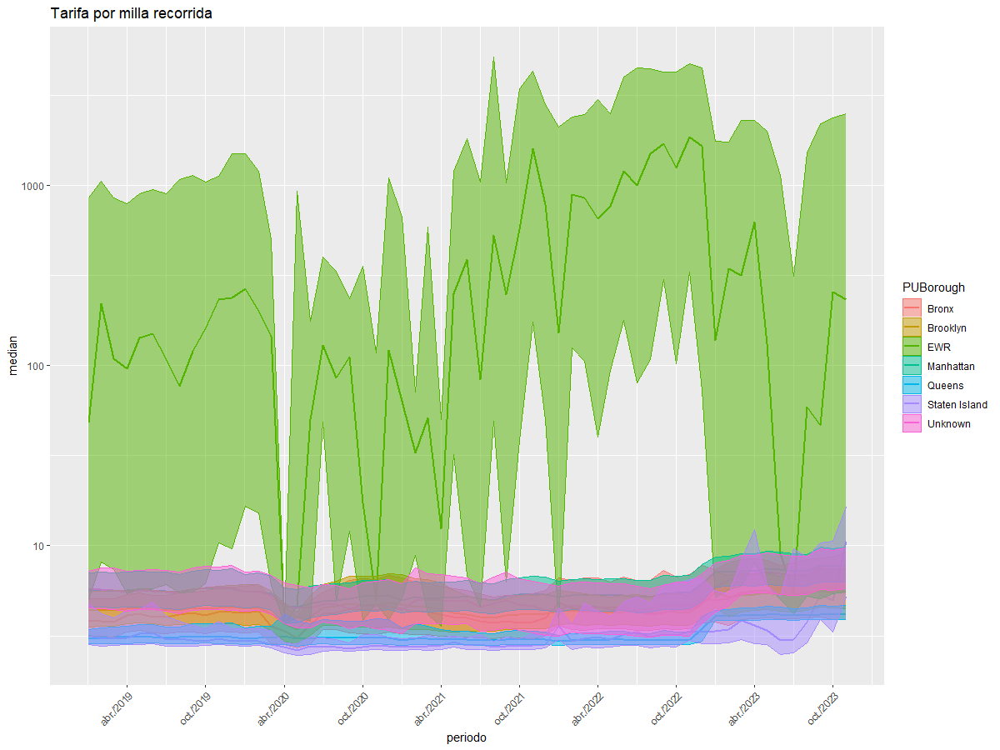
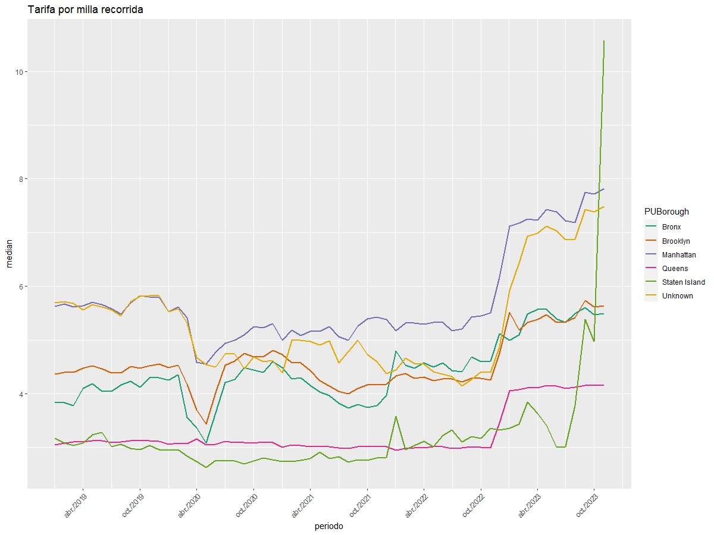

  
<b>Análisis temporal de tarifa cobrada por minuto de viaje segregada por Borough</b>

### Análisis temporal de tarifa cobrada por minuto de viaje segregada por Borough
Se analizaron los datasets parquets mensuales desde 2019-01 hasta 2023-11, se hizo una limpieza de datos rápida, se creó la medida “tarifa cobrada por minuto de viaje” ($fare_per_minute$) y se calcularon los percentiles 5, 25, 50, 75, 95 para cada Borough de partida y para cada mes. Lo que se observa es que EWR (zona aeropuerto Newark) tiene un rendimiento consistentemente superior (por un par de órdenes de magnitud) que el resto de los distritos (siempre considerando al distrito como Pick Up). Las bandas son los Q1 y Q3 por lo que estos resultados no estan arrastrados por outliers. Si excluimos EWR se observa que historicamente el que mejor performa son los viajes con origen en Staten Island con excepcion de algunos meses entre 2022 y 2023 que es superado por Queens. Manhattan, que es el distrito que por lejos concentra la mayor cantidad de viajes, en esta métrica performa bajo la media

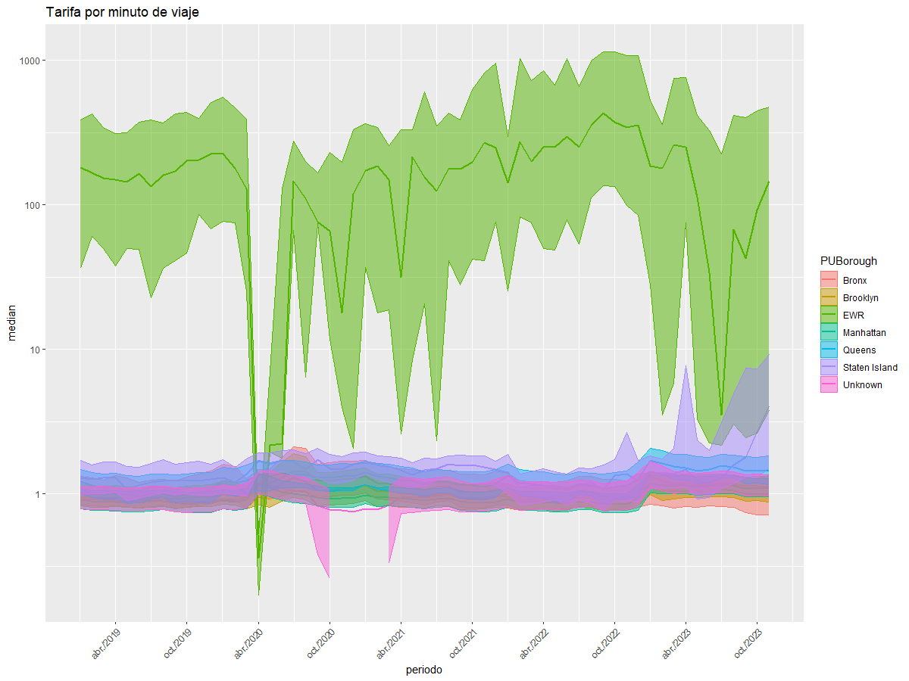
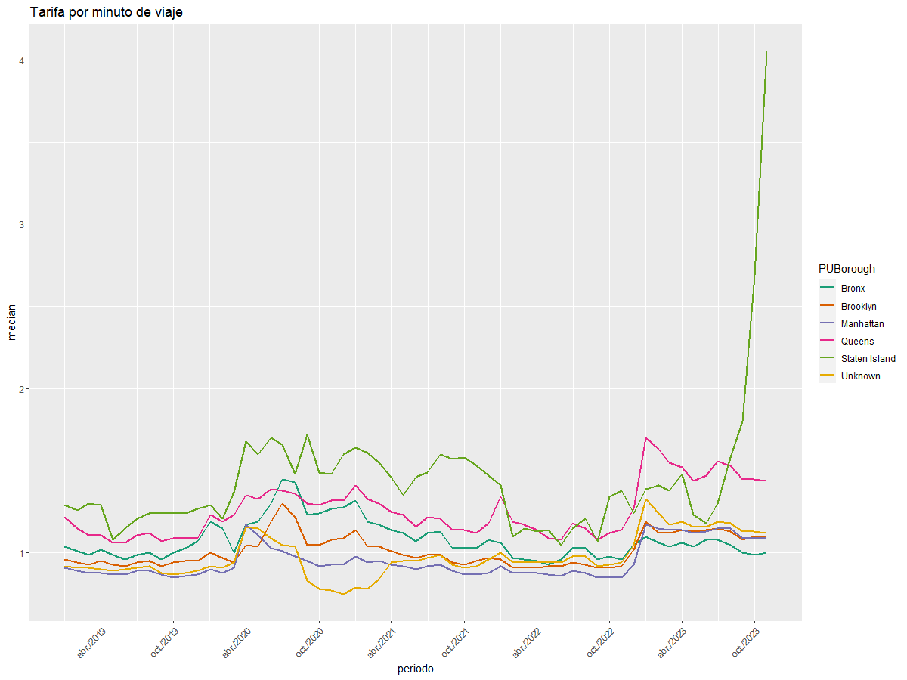

## Distancias recorridas y autonomía de vehículos
**Script utilizado: autonomia.R**

En esta sección se busca determinar el modelo de vehículo óptimo con el cual reemplazar a la flota de taxis existente en la empresa. Para ello se obtienen datos de como son los parámetros involucrados en cada turno de taxi en la ciudad.

  
<b>Distancias recorridas</b>

Se quiere determinar si la autonomía de los vehículos eléctricos autorizados para ser usados como taxis permite cubrir un turno (8hs) de trabajo (o 2) sin recargar. Para ello primero se evalúa la estadística mensual de tiempos y distancias de viajes para todos los Borough y para la ciudad de New York en su conjunto en funcion del tiempo (en la siguiente figura se muestra la evolucion de la mediana de $trip_distance$ por mes por Borough, las bandas límites representan $Q1$ y $Q3$)

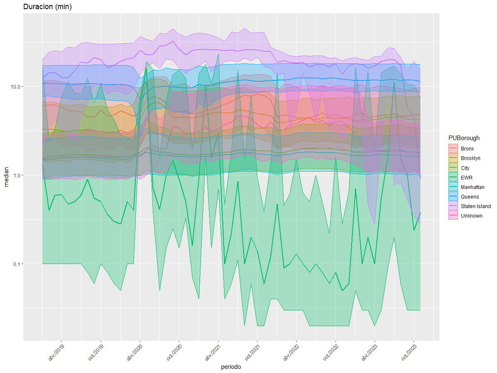

Para calcular cuantos viajes se espera poder realizar en un turno de taxi de 8 horas, se dividió las 8 horas por el 3er cuartil del tiempo de viaje en cada mes. Con lo cual se puede tener una estimación de la progresión temporal de la cantidad de viajes realizados por cada taxi en cada distrito de la ciudad (o en general para toda la ciudad). En la siguiente gráfica se considera que un taxi pasa tanto tiempo realizando un viaje como recorriendo las calles vacío en búsqueda de un pasajero (hay un factor 2 multiplicando el Q3).

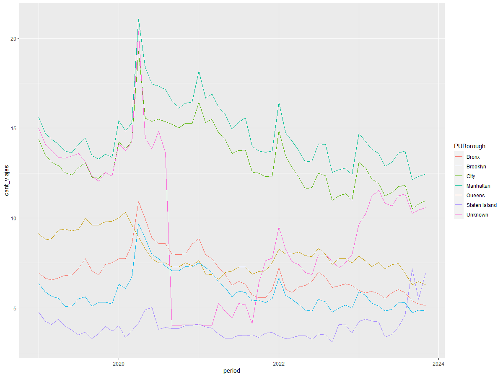

Sabiendo cuantos viajes se pueden realizar por turno de taxi, podemos calcular la distancia total recorrida por un taxi en un turno. Esto lo hacemos haciendo un cálculo similar al de tiempo de viaje pero con distancia de viaje, también tomando el $Q3$ de trip_distance como valor representativo. La distancia total recorrida será cant_viajes * Q3_distancia * 2. Donde otra vez hay un factor 2 multiplicando al $Q3$ de distancia recorrida para suponer que el taxi recorre la misma distancia para buscar un pasajero que cuando está en viaje. En la siguiente gráfica se muestran los resultados de la evolución de distancias recorridas durante un turno de 8hs por un taxi para viajes iniciados en cada distrito (o para la ciudad en general). 

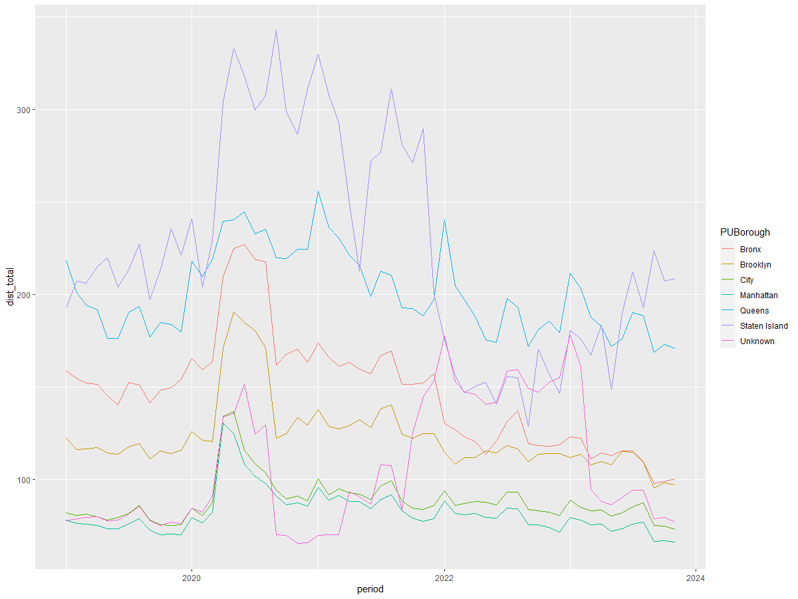

  
<b>Autonomía EV</b>

Si comparamos con la autonomía de los modelos de EV habilitados para ser utilizados como taxis por NYC

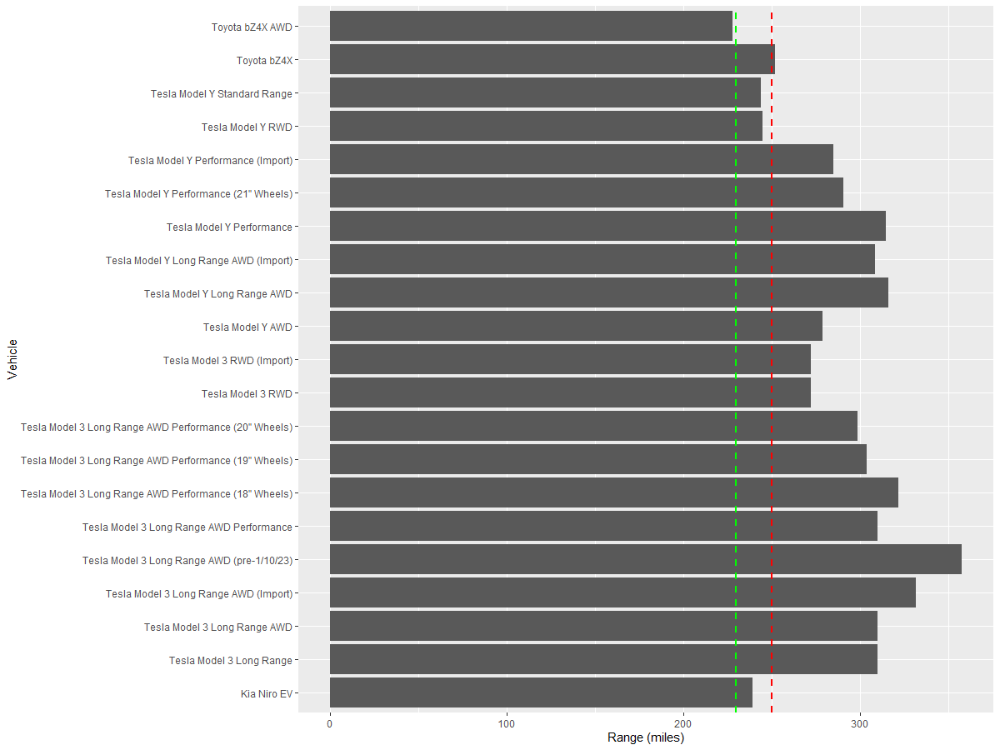

Donde se observa que todos los vehículos habilitados excepto el Toyota bZ4X permitirían cubrir un turno de taxis sin recarga con las condiciones de los ultimos 2 años. Extenderse a cumplir las condiciones históricas llevaría el límite a 250 millas y ahí los Model Y Standard Range y Model Y RWD de Tesla y el Niro EV de Kia se quedarían fuera de la especificación.

Ningún modelo alcanza a cubrir las necesidades de 2 turnos de taxi sin recargar.

Los modelos Long Range de Tesla, con 340 millas de autonomia podrian cubrir 2 turnos con una carga intermedia del 50% de la capacidad de la bateria.

## Análisis de incidencia sobre emisiones contaminantes
**Script utilizado: calidad_aire.R**

Se sabe que el transporte público de pasajeros tiene una contribución importante en la emisión de gases contaminantes en NYC, motivo de la obligatoriedad de pasar la flota de taxis a autos eléctricos para 2030. Se buscó determinar la relación entre la proporción de taxis con motor a explosión y los híbridos para determinar una posible incidencia de estos últimos sobre la mejora de la calidad del aire en NYC. Para ello se utilizaron los datasets de calidad de aire provistos y los de licencias históricas de taxis provistos por NYC.

En el dataset de calidad de aire se cuenta con una gran cantidad de parámetros medidos a lo largo de los años y, muchos de ellos, con distribución geográfica. Se decidió seguir aquellos parámetros relacionados con PM2.5 (concentración de particulas de 2.5 micrones en el aire) y con NO2 dado que son los que presentan una correlación mas directa con la emisión de vehículos. Por el otro lado, el dataset de licencias contine la información diaria del estado de los vehículos que actualmente se encuentran en circulación (por lo que es un registro histórico de los taxis actuales)

  
<b>Análisis del dataset licencias de taxis históricas</b>

Incluso el dataset histórico sólo tiene en cuenta los autos que actualmente se encuentran en circulación (son registros históricos para los autos activos). Dado que es en función de la flota de taxis actual no se puede saber exactamenta la evolución temporal de las licencias. Se realiza la suposición que los taxis son comprados nuevos por lo que Model.Year (año del vehiculo) es un indicativo de cuando determinado auto entró como taxi en NYC. Otra suposición es que la cantidad de licencias no cambió en el período del que hay información (min(Model.Year) a max(Model.Year)). Con estas suposiciones se planteó que el total de taxis en NYC corresponde a la suma de registros distintos en el dataset (24117 que se encuentra en línea con lo que informa la página de wikipedia respecto a la cantidad de taxis amarillos) y analizó la proporción de taxis híbridos a medida que van entrando a la flota. En este dataset no hay registro de taxis electricos. La figura siguiente de la izquierda está calculada en base al dataset histórico que llega hasta el 2017, la figura de la derecha es con el dataset actualizado que llega hasta el 2023. En este último dataset aparecen 25 taxis BEV (battery electric vehicle), lo que en proporción respecto del total de la flota es marginal.

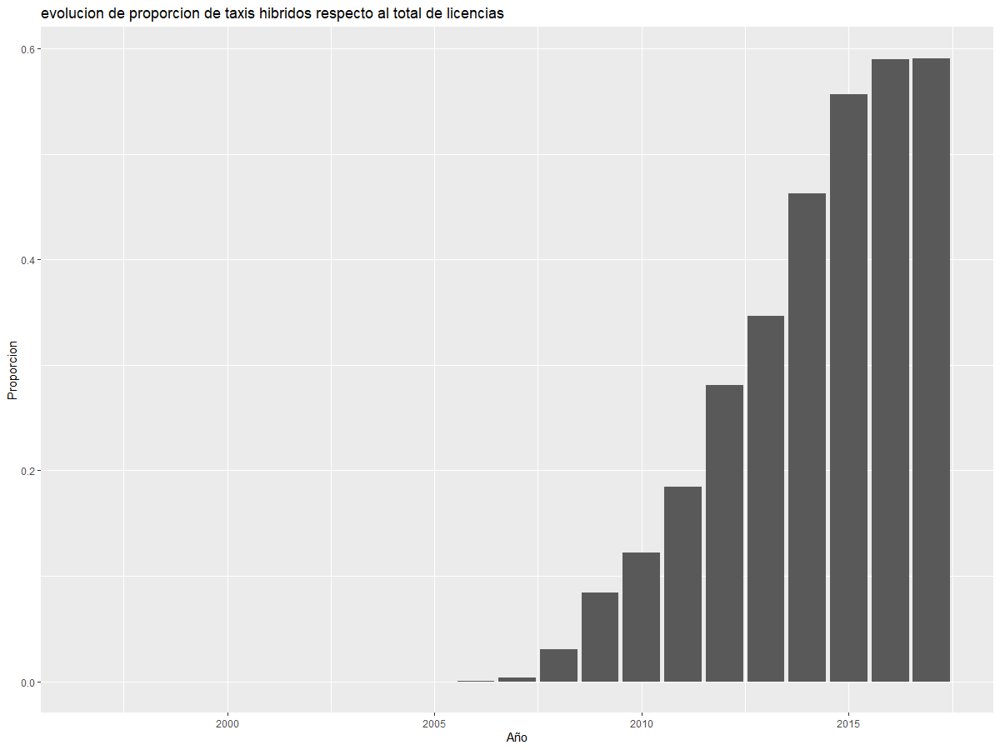
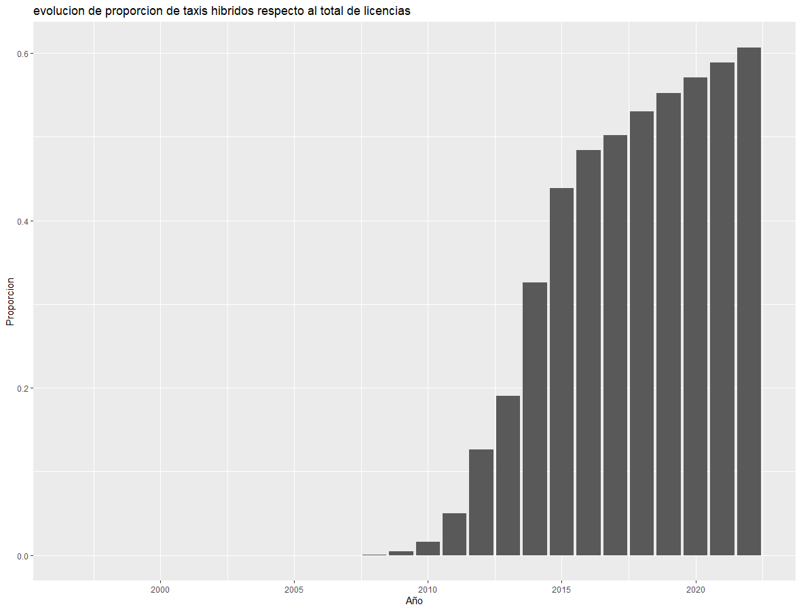
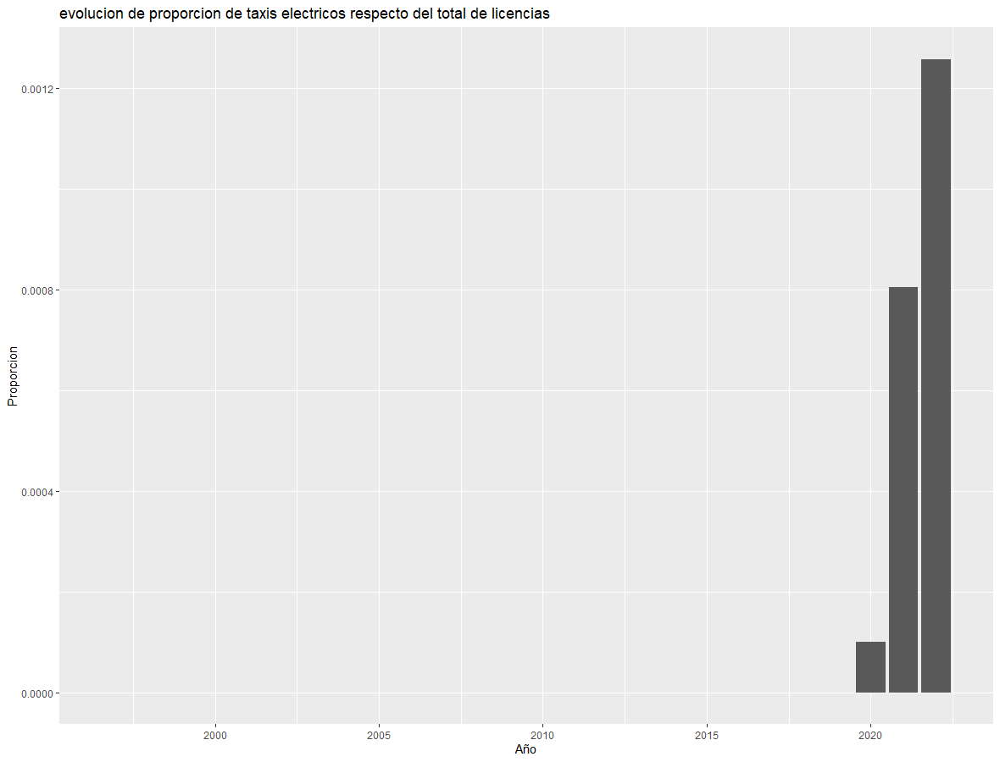

  
<b>Correlacion con calidad del aire</b>

Se tomaron datos de calidad de aire y se buscó de correlacionar las tendencias observadas con el incremento de taxis hibridos. En un principio se intentó utilizando los registros de mediciones anuales de PM2.5 en funcion del tiempo y por Borough. Significativamente se observa que: 1ero que la tendencia es marcadamente a la disminucion de PM2.5 en función del tiempo y 2do que los datos comienzan a ser obtenidos recién en 2014, justo cuando los taxis híbridos empiezan a aparecer. Estas dos cosas, tendencia a la baja y coincidencia temporal con los taxis impide hacer una correlación entre ambos porque no hay un control del tipo “calidad del aire antes de la aparicion de los taxis hibridos” con lo cual no se puede asegurar que la disminucion de PM2.5 sea por efecto de los hibridos utilizando estos parámetros por si solos o sin un procesamiento.

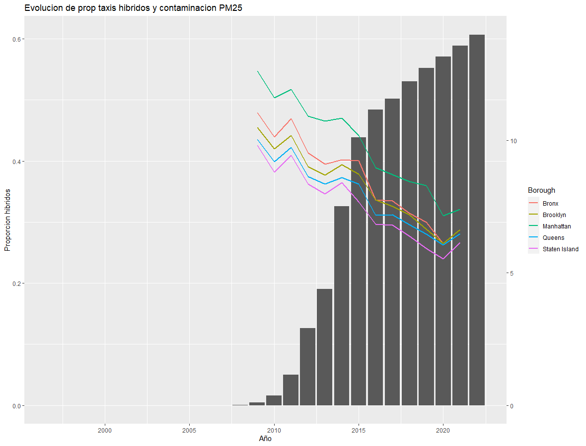

Se buscaron otras mediciones de calidad de aire que tuvieran un rango temporal mas amplio de modo de poder generar la comparación de control anteriormente mencionada. Se trató con NO2 pero las conclusiones son similares.

Ante este inconveniente se discutió y puso a prueba la hipótesis de que la tasa de incremento de taxis hibridos pueda producir un mayor incremento en la calidad del aire. Lo que significa comparar las derivadas de ambos. En la gráfica siguiente se ve la derivada de la evolución de concentración de NO2 en aire para el distrito de Manhattan (azul) y la derivada de la evolución de la proporción de taxis híbridos en la ciudad de new york (multiplicada por -1 y afectadas escalas para hacerlos comparativos) donde se observa que el momento donde se produce la mayor incorporación de taxis hibridos coincide con la disminución de la tasa de mejora de la calidad de aire. Este mismo resultado se observa en todos los distritos. Cabe mencionar que para realizar las derivadas fue necesario realizar una etapa de suavizado dado que el ruido en las mediciones se trasladaba a la derivada de una forma que la volvia poco confiable, aún así debido a la poca cantidad de datos el filtro de suavizado tiene una incidencia fuerte en el resultado pudiendo estar enmascarando posibles tendencias.

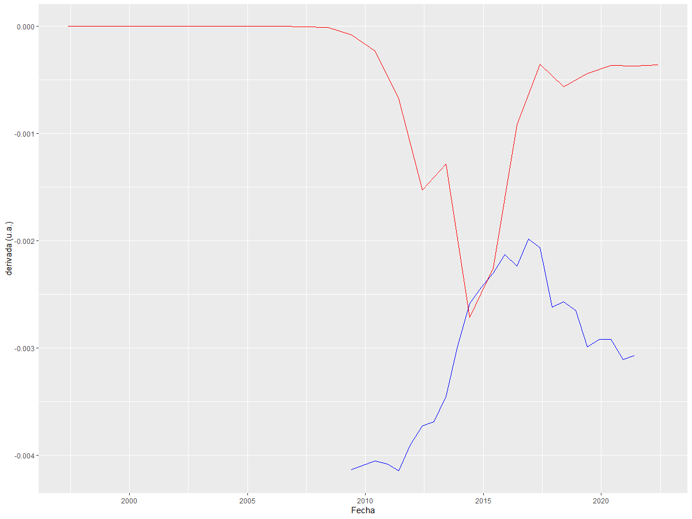

Entre los datos relacionados con PM2.5, además de los datos anuales por Borough como fue hecho mas anteriormente, se cuenta con los datos por estacion (verano, invierno, etc.) o sea, trimestrales. Esto nos permite tener una mayor densidad de puntos en las curvas que va a redundar en una mayor calidad al momento de realizar las dervidas. Se tomó el dataset de calidad de aire y se filtro por “Indicator.ID == 365” (Fine Particle (PM2.5)), por tipo de region Geo.Type.Name == “Borough” y por Time.Period no conteniendo “Annual Average” (esto descarta las mediciones anuales y deja las trimestrales). La evolución trimestral de la concentracion de PM2.5 en aire es primero suavizada por el metodo loess (usando polinomio ordern 1 y span = 0.7) y luego se calcula la derivada. Como ejemplo de resultado (representativo de lo que se observa para todos los Borough) es la siguiente gráfica para Manhattan

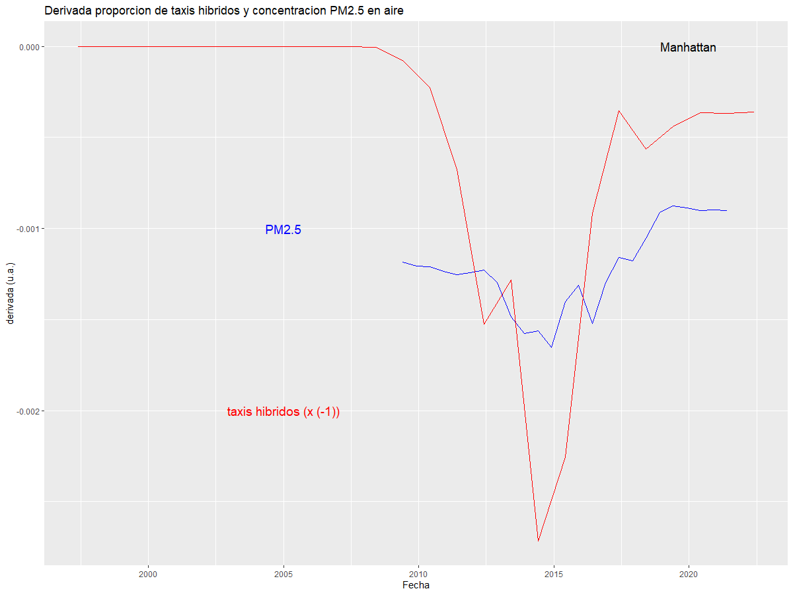

donde se gráfica la deridad de la concentración de PM2.5 en aire y la evolución de la proporción de taxis hibridos en la ciudad en función del tiempo. La derivada de los taxis se representa multiplicada por (-1) para facilitar la compración. Se observa que hay una correlación entre el máximo cambio de la proporción de taxis hibridos (el momento en que más taxis se incorporaron) con el mayor cambio en la concentración de PM2.5 en aire hacia valores mas chicos. Pasado el ímpetu inicial, la tasa de cambio de taxis a híbridos se reduce (como se observa en las figuras anteriores donde la proporción de taxis híbridos parece estabilizarse a 0.6) y en estos momentos la tasa de cambio de la concentración de PM2.5 disminuye (en terminos de valor absoluto). Esto parece indicar que la incorporación de vehículos más amigables con el medio ambiente tiene una relacion directa con la tasa de mejora de la calidad de aire en la ciudad sin embargo entra en contradicción con lo observado para NO2 con lo cual estos resultados por sí solos no son concluyentes.

  
<b>Disminución emisiones de gases invernadero</b>

**Script utilizado: modelo_empresa.R**

Para el 4to KPI se propone que la empresa disminuya su huella de emisión de gases contaminantes para ser neutros en carbono para el 2030. Para ello se establece una disminución gradual a medida que se van incorporando EV a la flota. Teniendo en cuenta la optimización del cronograma de incorporación de EV a la flota analizada en la sección Modelo Económico de la Empresa se modela la disminución de emisión con este plan de incorporación.

 Se determinó la emisión actual de los autos de la empresa (Chevrolets Malibu 0.342 Kg/milla de emisión) determinando la cantidad de millas recorridas por la flota mes a mes. Se modeló cuáles serían las distancias recorridas por la flota de taxi entre 2024 y 2030 y se la afectó por la emisión de la flota teniendo en cuenta el plan de incorporacion de EV.

 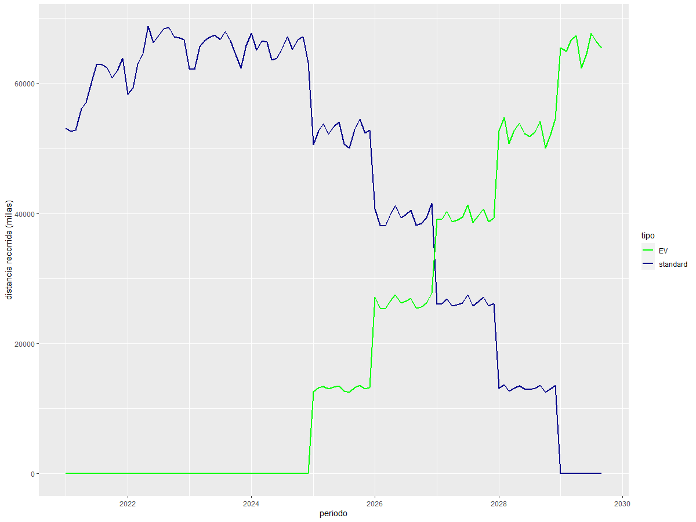
 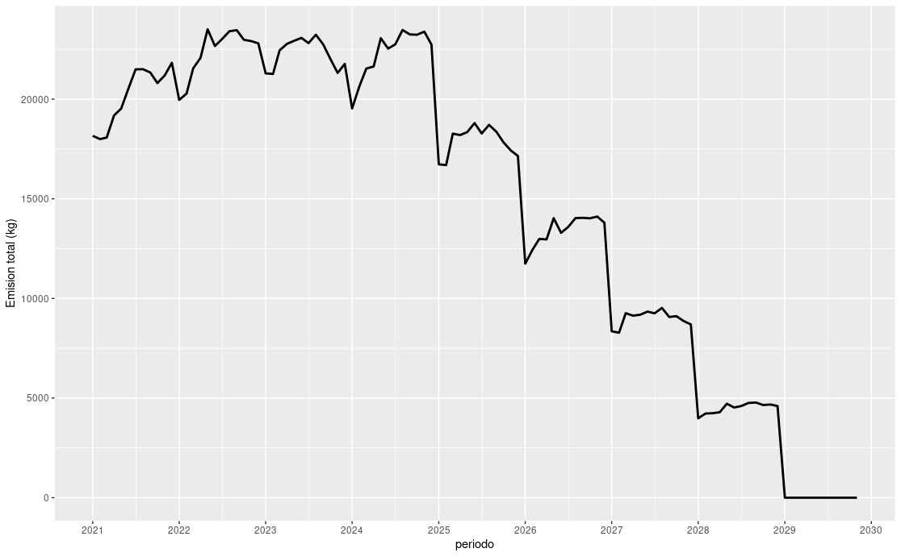

## Modelo Económico de la Empresa
**Script utilizado: modelo_empresa.R**

En esta seccion vamos a modelar la economia de la empresa temporalmente dividiéndolo en 2 partes: pre y post a la aplicación de las recomendaciones de este trabajo. Lo primero que necesitamos conocer es cuantos vehículos posee la empresa, supongamos N_taxi = 50 y son Chevrolet Malibu con un precio de mercado (0km) de $26k y estimado de consumo $135/mes de combustible para NYC (https://www.edmunds.com/chevrolet/malibu/). Ademas suponemos que la empresa es una empresa de la media, no tiene un redimiento ni bueno ni malo.

  
<b>Costos previos trabajo</b>

Sabemos que el costo operativo de 1 taxi para una empresa es de $25k al año que incluye el costo de renovación cada 3 años (o sea $8k/año para el Malibu), si exceptuamos el costo de renovación (porque van a ser renovados por EV) entonces el costo operativo queda $25k - $8k = $17k. Esto es para el Malibu, auto convencional, si lo mensualizamos y excluimos el costo de combustible quedan $1240/mes para cada taxi (ahora independiente de si es el Malibu o no), supongamos que este es el costo mensual por taxi independientemente de combustible (mantenimiento, seguros, impuestos, etc.). Ahora si suponemos un costo de mantenimeinto de $3528/anuales para el Chevrolet Malibu (uso 80%-20% ciudad-autopista, https://www.aaa.com/autorepair/drivingcosts/NY-N-2024/Chevrolet/Malibu/1LT%204D%20Sedan/at-20000-miles/on-80-city), resulta en un costo de mantenimiento de $294/mes, con lo cual, los costos fijos (seguros, impuestos, etc.) serían de $946/mes y, ahora si, este costo fijo lo podemos suponer como transmitible directamente a los taxis EV.

  
<b>Ingresos previos trabajo</b>

Si suponemos que la empresa es una empresa media, entonces vamos a modelarla como que es una empresa con N_taxi = 50, con un modelo de negocios híbrido donde cobra un leasing reducido pero a cambio de un porcentaje de la tarifa bruta cobrada en cada viaje. Bajo la suposición que es una empresa media podemos modelarla en que sus taxis toman viajes en toda la ciudad con la misma probabilidad que sucede en cada dataset, lo cual nos permite decir que los viajes por mes de la empresa sean modelados tomando al azar sin repeticion (N_taxi * cant_viajes/taxi/dia * 30 dias/mes) registros de cada dataset mensual, donde cant_viajes/taxi/dia fue calculado previamente (16 viajes por taxi por dia considerando toda la ciudad, dado que es una empresa promedio, para 1 turno de 8hs, promediado para el ultimo año), llevando a 19500 viajes por mes para toda la flota de la empresa. Se extraen 19500 registros al azar sin repetición de cada dataset mensual de taxis amarillos durante 2022 y 2023, con esto se reconstruye la performance de la empresa.

Los ingresos de cobrados por los taxis en cada mes será la suma de fare_amount en esos 19500 registros. Los ingresos de la empresa serán un 33% del ingreso por tarifa cobrada más un leasing fijo diario de $100 para cada turno de cada taxi (los $100 provienen de $150/3 donde $150 es un valor esperable de leasing diario para taxi de NYC si no se pide participación de ingreso por viaje, se disminuye 1/3 para compensar la parte de la tarifa). El ingreso del taxista es el ingreso total menos esta transferencia a la empresa, el profit de la empresa es el ingreso de la misma menos los costos operativos de la flota mencionados anteriormente. Se supone que el taxista es responsable del costo de carga de combustible pero la empresa por todo el resto (mantenimiento, impuestos, seguros, etc.). El resultado de ingresos de la flota de taxi, de la empresa de taxi, y del profit de la empresa en los últimos dos años previos a las recomendaciones de este trabajo se muestran en la siguiente gráfica

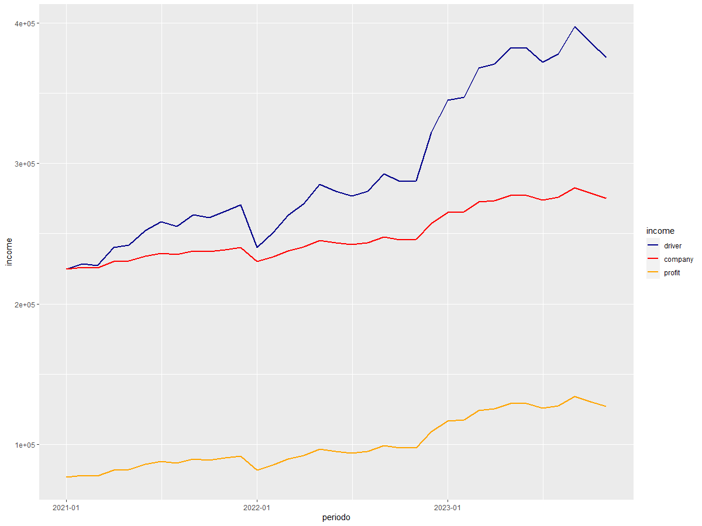

  
<b>Costos por cambio de flota (inversión)</b>

Se propone realizar los cambios de los autos de la flota mediante la toma de créditos a 2 años con una tasa del 5% anual y que el recambio sea gradual entre 2025 y 2030 (fecha límite para tener toda la flota en EV). De esta forma se distribuye la inversión en créditos de menor valor. El modelo matemático toma la inversión es en $j$ etapas, incorporando N_taxi / j nuevos vehículos por (2030-2025) / j años. La optimización del modelo, para minimizar el costo de capital resulta en $j = 5$. De esta forma, la evolución de incorporación de EV y de pagos de creditos son:

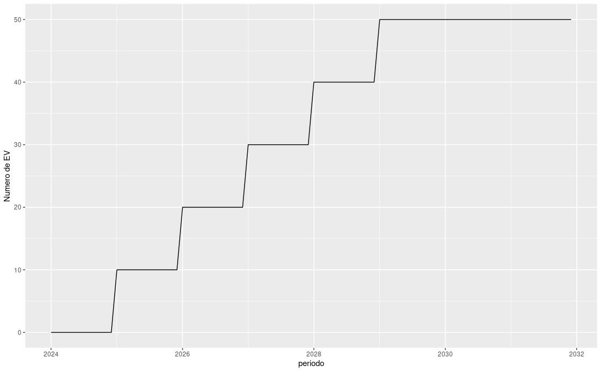
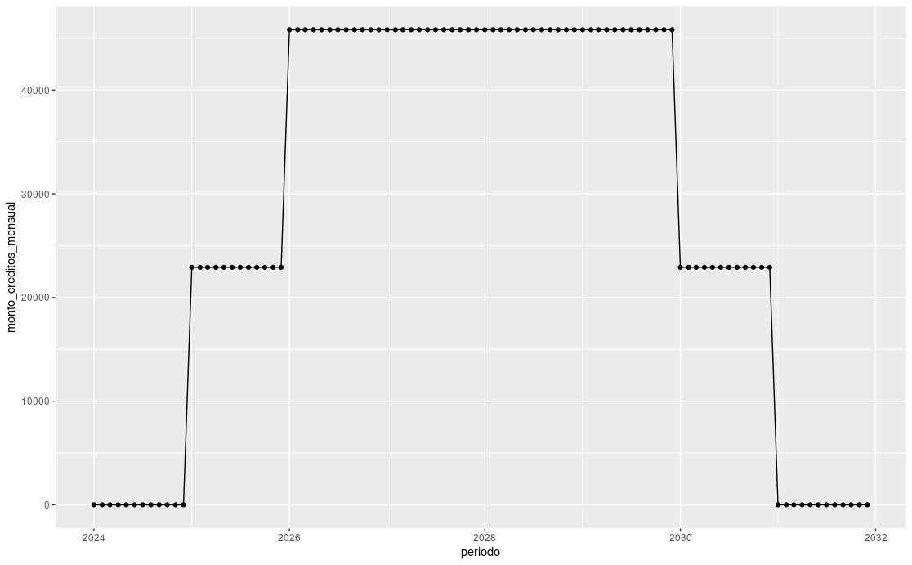

El modelo matemático se detalla con más profundidad en la documentación correspondiente.

  
<b>Ingresos y costos futuros</b>

Para modelar la segunda parte, hacia futuro, se situó en un escenario neutro donde la performance de la empresa no cambie con el tiempo con lo cual siga manteniendo los mismos valores en las metricas analizadas, esto se realiza tomando el período del último año de datos existentes y se lo proyecta a futuro afectándolos por una función de ruido gaussiano controlado por la desviación estandar de los datos en el período original, de esta forma las variables mantienen sus tendencias estacionales.

